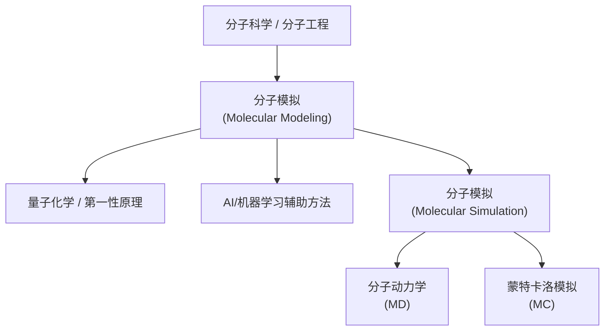

## SPONGE的中文翻译是什么？

在成果填报中，经常需要填写SPONGE的中文翻译。SPONGE是“Simulation Package tOwards Next GEneration molecular modeling”的缩写，直译的话是“面向下一代分子模拟的模拟软件包”。

这个翻译里存在一个问题，就是存在两个“模拟”，读起来挺让人迷惑。我们可以问一下目前的各类大语言模型 AI 这个问题：`“面向下一代分子模拟的模拟软件包”中两个模拟有什么区别？用一句中文回答。`，结果如下（采样于2026年5月6日）。

| 模型 | 回答 |
| --- | --- |
| Deepseek v4 专家模式 | 第一个“模拟”指学科领域，第二个“模拟”指具体程序工具。 |
| Kimi-2.6 思考 | 前者是基于经典力场的传统分子动力学模拟，后者是基于机器学习势函数的AI驱动模拟。 |
| ChatGPT-5.5 Thinking | 前一个“模拟”指“分子模拟”这一研究任务/领域，后一个“模拟”指软件包的功能类型，即用于执行模拟的软件。 |
| Opus 4.7 Adaptive Thinking | 第一个"模拟"指应用对象（即"分子模拟"这一研究活动/领域），第二个"模拟"则是软件的功能定语（说明这是一款用来做模拟计算的软件包）。 |

可以看到，在中文问题里，模型大多会把注意力放在两个“模拟”的语法位置和修饰关系上。然后再用英文原名问一遍：`What's the difference between simulation and modeling in the name "Simulation Package tOwards Next GEneration molecular modeling"? Answer in one Chinese sentence.`，结果如下。

| 模型 | 回答 |
| --- | --- |
| Deepseek v4 专家模式 | 在名称“Simulation Package tOwards Next GEneration molecular modeling”中，“simulation”侧重于通过计算模拟分子系统的动态行为过程，而“modeling”则更强调构建分子系统的静态理论模型或表示。 |
| Kimi-2.6 思考 | "Simulation" 指实际的分子动力学计算执行过程，而 "modeling" 指分子体系的理论模型构建与表示。 |
| ChatGPT-5.5 Thinking | 这里的 modeling 指对分子体系及其物理化学规律的抽象、建模与表示，而 simulation 指基于这些模型进行数值计算和动态采样的软件实现。 |
| Opus 4.7 Adaptive Thinking | 建模(modeling)是指为分子体系构建数学与物理表征(如力场、结构、参数等静态描述),而模拟(simulation)是指基于该模型通过数值计算推演体系随时间演化的动力学行为,前者是"搭建对象",后者是"运行对象"。 |

这组回答就很有意思：当问题换回英文原名时，模型不再纠结两个“模拟”的中文重复，而是自然地区分了 simulation 和 modeling 两个概念。也就是说，中文翻译里的问题并不只是字面上重复了两个“模拟”，更深层的问题在于 molecular simulation 和 molecular modeling 在中文语境中最广为接受的翻译一般都是“分子模拟”[^nankai-mm][^shu-modeling][^shiyanjia-simulation]。虽然 molecular simulation 偶尔也会被译作“分子仿真”，molecular modeling 也偶尔会被译作“分子建模”，但这些译法都不是最主流的说法。于是，英文里原本可以区分的“运行模拟”和“建立模型”，在中文里很容易被“分子模拟”这个统一译名混淆到一起。

## 分子模拟（Molecular Modeling）

Molecular Modeling 本身也有两种常见英文写法：美式拼写为 Modeling，英式拼写为 Modelling。二者在这里没有实质区别，指向的是同一个概念。

需要注意的是，Molecular Modeling 实际上是一个非常宽泛的概念。凡是用计算机对分子或分子体系进行描述、表示、构建、预测和分析的方法，大体上都可以放在这个范畴下。因此，它并不只等同于分子动力学一类“跑起来”的模拟，也包括量子化学/第一性原理计算、分子结构建模、对接与构象搜索、机器学习势函数，以及 AI/机器学习辅助的分子性质预测和分子设计等。

如果把分子科学（Molecular Science）看作研究分子体系的结构、性质、相互作用和变化规律，把分子工程（Molecular Engineering）看作为了目标功能而设计和改造分子体系，那么 Molecular Modeling 就是贯穿二者的一条计算化路径：它通过模型、算法和数据，把分子体系转化为可以计算、预测和优化的对象。宽泛地说，它接近于计算分子科学或计算分子工程。

## 分子模拟（Molecular Simulation）

相比 Molecular Modeling，Molecular Simulation 的范围更具体一些。它通常指在已经给定某种模型、势能函数或物理规律之后，通过数值计算来研究分子体系的结构、热力学性质、动力学行为和时间演化过程。

典型的 Molecular Simulation 包括分子动力学（Molecular Dynamics, MD）和蒙特卡洛（Monte Carlo, MC）模拟。它们共同的特点是：先有一个能够描述体系能量或转移概率的模型，然后用计算机在这个模型上进行采样、演化或统计，进而得到实验中不容易直接观察到的微观信息。

因此，如果说 Molecular Modeling 更像是“如何把分子体系变成一个可计算的对象”，那么 Molecular Simulation 更像是“在这个可计算对象上运行起来，观察它会怎样变化”。前者是更大的概念，后者则是其中非常重要的一类方法。

[^nankai-mm]: 课件中写明“分子模拟（Molecular Modeling）”。孙宏伟. 《量子化学与分子力学/分子模拟》第一章绪论. 南开大学. [https://www.collegesidekick.com/study-docs/19985383](https://www.collegesidekick.com/study-docs/19985383)

[^shu-modeling]: 文章中文标题为“计算机分子模拟”，英文标题对应 Computer molecular modeling。唐赟, 李卫华, 盛亚运. *计算机分子模拟——2013年诺贝尔化学奖简介.* 自然杂志, 2013, 35(6): 408-415. 中文页：[https://www.nature.shu.edu.cn/CN/Y2013/V35/I6/408](https://www.nature.shu.edu.cn/CN/Y2013/V35/I6/408)；英文页：[https://www.nature.shu.edu.cn/EN/Y2013/V35/I6/408](https://www.nature.shu.edu.cn/EN/Y2013/V35/I6/408)

[^shiyanjia-simulation]: 页面中写明“分子模拟（Molecular Simulation）”。科学指南针. 分子模拟简介. [https://www.shiyanjia.com/knowledge-articleinfo-3847.html](https://www.shiyanjia.com/knowledge-articleinfo-3847.html)
